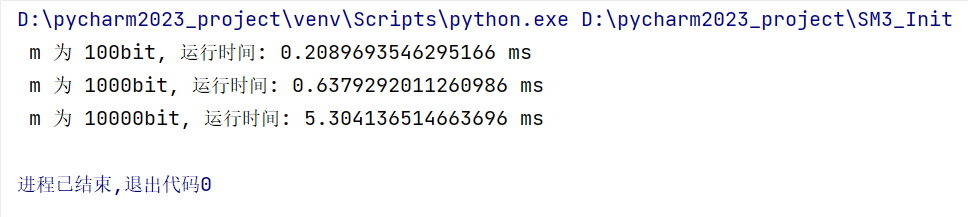
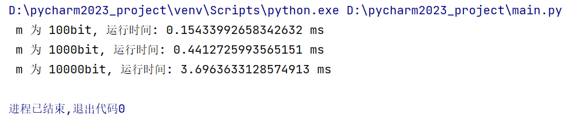

<div align="center">

</div>

<!-- ********************* Chapter1 ********************* -->

## 1 分工表格

---

<center>

| 姓名  |      学号      | 分工    |
|:---:|:------------:|-------|
| 刘晨曦 | 202100460042 | SM3实现 |
| 卢梓宁 | 202100460043 | SM3优化 |
| 陈辉华 | 202100460044 | SM3优化 |

</center>

<!-- ********************* Chapter2 ********************* -->

## 2 SM3算法

---

SM3算法是一种密码学哈希算法，它被广泛应用于信息安全领域，
是中国密码领域的国家标准，用于取代MD5和SHA-1等算法。
SM3算法具有较高的安全性和抗碰撞能力，在数字签名、
身份验证、数据完整性校验等领域得到广泛应用。它在安全性、
性能和标准化方面都具备优势，因此在中国和国际上都受到广泛关注和采用。

### 2.1 SM3加密算法介绍

SM3可将长度小于2的64次方bit的消息经过填充、反复的消息扩展和压缩，
生成长度为256比特的杂凑值。在SM3算法中，消息的加密单位为32bit。

### 2.2 加密过程

#### 2.2.1 消息填充并分组
要使填充后的消息比特长度为512的倍数。设消息的长度为l比特。
填充方式为：    
- 将比特“1”添加到消息的末尾； 
- 添加k个“0”，k是满足l+1+k=448(mod512)的最小的非负整数； 
- 将消息长度l的64位二进制表示添加在最末。

将填充后的消息分为512bit每组
```
def Extend(m):
    M = bin(int(m,16))[2:]
    if len(M) != len(m)*4:
        M = '0'*(len(m)*4-len(M)) + M
    l = len(M)
    l_bin = '0'*(64-len(bin(l)[2:])) + bin(l)[2:]
    M = M + '1'
    M = M + '0'*(448-len(M)%512) + l_bin
    M = hex(int(M,2))[2:]
    return M
    
def Divides(m):
    n = len(m)/128
    M = []
    for i in range(int(n)):
        M.append(m[0+128*i:128+128*i])
    return M
```

#### 2.2.2 消息加密
以下为加密函数主体
```
def Hash(V,M,i):
    A,B,C,D,E,F,G,H = V[i]
    W,W_ = Expand(M,i)
    for j in range(64):
        SS1 = LEFT((LEFT(A,12)+E+LEFT(TT(j),j%32))%(2**32),7)
        SS2 = SS1 ^ LEFT(A,12)
        TT1 = (FF(A,B,C,j)+D+SS2+W_[j])%(2**32)
        TT2 = (GG(E,F,G,j)+H+SS1+W[j])%(2**32)
        D = C
        C = LEFT(B,9)
        B = A
        A = TT1
        H = G
        G = LEFT(F,19)
        F = E
        E = P0(TT2)
    a,b,c,d,e,f,g,h = V[i]
    V_new = [a^A,b^B,c^C,d^D,e^E,f^F,g^G,h^H]
    return V_new

def SM3(M):
    n = len(M)
    V = []
    V.append(IV)
    for i in range(n):
        V.append(Hash(V,M,i))
    return V[n]
```

<!-- ********************* Chapter3 ********************* -->

## 3 软件优化

### 3.1 消息扩展优化
消息扩展的目的是利用512比特的消息分组B扩展得到68个字W0,…,W67和64个字W′0,…,W′63。

快速实现时，为了尽可能减少不必要的数据加载和存储，W0,…,W67和W′0,…,W′63的计算可以调整到压缩函数里执行。具体实现过程如下：

- 首先在执行64轮压缩函数前只计算初始的4个字W0,…,W3；
- 然后在压缩函数的第i轮生成Wi+4，而W′i则使用W′i=Wi⊕Wi+4代替。

经过这样的调整，去掉了字W′0,…,W′63，减少了字W0,…,W67和W′0,…,W′63的加载和存储次数，提高了消息扩展的速度。

### 3.2 压缩函数优化
**1. 加密结构优化**
>压缩函数的结构可以做适当的调整。压缩函数每一轮的最末会执行如下所示的循环右移，A‖B‖C‖D←(A‖B‖C‖D)>>>32,E‖F‖G‖H←(E‖F‖G‖H)>>>32。为了减少循环移位导致的不必要的赋值运算，可以将字的循环右移变更每轮输入字顺序的变动，且这个顺序变动会在4轮后还原，具体情况如下：

```
OneRound(i+0,A,B,C,D,E,F,G,H,W)
OneRound(i+1,D,A,B,C,H,E,F,G,W)
OneRound(i+2,C,D,A,B,G,H,E,F,W)
OneRound(i+3,B,C,D,A,F,G,H,E,W)
```
**2. 加密步骤优化**
>可以优化压缩函数的中间变量的生成流程。此优化生成流程可以去除不必要的赋值，减少中间变量个数。优化后的执行步骤如下：

```
SS2 = LEFT(A, 12)
SS1 = LEFT((SS2 + E + LEFT(T[0], j % 32)) % (N), 7)
SS2 = SS1 ^ SS2
D = (FF16(A,B,C)+D+SS2+(W[j]^W[j+4]))%(N)
H = (GG16(E,F,G)+H+SS1+W[j])%(N)
B = LEFT(B,9)
F = LEFT(F,19)
H = P0(H)
```
**3. 预处理常数优化（代码中没有实现）**
>预先计算并存储常数ti=Ti<<<i。这可以避免每个消息分组都去计算常数，且占用的存储空间也很少，仅256Byte。

## 4 优化前后效率对比

---

对时间的测量具有误差，但通过代码分析可以得到，在消息长度越长的时候，加速比将会越大，做表如下：

| 消息长度  | 优化前执行时间/ms | 优化后执行时间/ms | 加速比     |
|:-----:|:----------:|:----------:|---------|
|  100  |   0.2090   |   0.1543   | 135.45% |
| 1000  |   0.6380   |   0.4413   | 144.57% |
| 10000 |   5.3041   |   3.6963   | 143.49% |

附图如下：  
**1. 优化前SM3哈希结果** 
> 

**2. 优化后SM3哈希结果**
> 