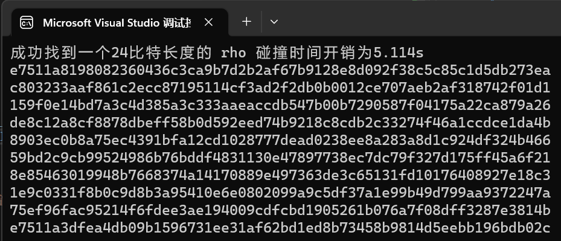
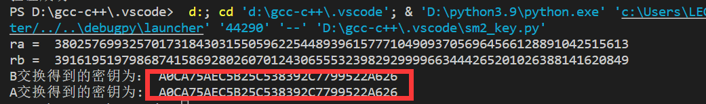

# 2023 SDU-A627-WorkforIAE 创新创业实践项目

队伍成员:

     姓名   学号
    刘晨曦 202100460042
    卢梓宁 202100460043
    陈辉华 202100460044

## 项目总结
本小组为温隆老师同意用信安作品赛项目作为结课作业的小组，除此之外，我们额外做了9个我们觉得有意思的项目。以下是我们的项目汇总

## PROJECT 1：
### PROJECT NAME：implement the naive birthday attack of reduced SM3
### PROJECT DIVISION：

| 姓名  |      学号      | 分工 |
|:---:|:------------:|----|
| 刘晨曦 | 202100460042 | SM3代码实现 |
| 卢梓宁 | 202100460043 | 生日攻击实现 |
| 陈辉华 | 202100460044 | 生日攻击实现|

### PROJECT SUMMARY：
实验测试得到sm3的不同长度的生日碰撞所需要的时间开销，具体为
16bit的碰撞需要0.130s,24bit需要4,476s而32bit就需要66.138s。

| 碰撞长度  |      碰撞结果      | 时间开销 |
|:---:|:------------:|----|
| 16bit |  bb41 | 0.130s |
| 24bit | 9a88e8 |  4.476s |
| 32bit | 6b571c4f | 66.138s|

>  
>  
>  

## PROJECT 2：
### PROJECT NAME：implement the Rho method of reduced SM3
### PROJECT DIVISION：

| 姓名  |      学号      | 分工 |
|:---:|:------------:|----|
| 刘晨曦 | 202100460042 | Rho碰撞实现 |
| 卢梓宁 | 202100460043 | Rho碰撞实现 |
| 陈辉华 | 202100460044 | Rho碰撞实现 |

### PROJECT SUMMARY：
实验通过不断计算一个随机数的SM3杂凑值，最终形成一个闭环，最终找到符合条件的碰撞。
具体的实验结果如下，打印出找到碰撞的时候环中的元素。

| 碰撞长度  |      碰撞结果      | 时间开销 |
|:---:|:------------:|----|
| 16bit |  6ef9... | 0.006s |
| 24bit | e7511a... |  5.114s |

>  
>  

## PROJECT 3：
### PROJECT NAME：implement length extension attack for SM3, SHA256, etc.
### PROJECT DIVISION：

| 姓名  |      学号      | 分工        |
|:---:|:------------:|-----------|
| 刘晨曦 | 202100460042 | SHA256实现  |
| 卢梓宁 | 202100460043 | SHA256优化  |
| 陈辉华 | 202100460044 | SHA256长度攻击 |

### PROJECT SUMMARY：

根据SHA-256的Merkle-Damgard结构，在original message的填充信息之后添加new message，通过适当的bit修改进行生日碰撞，构造相同的哈希值进行长度扩展攻击。

>   

## PROJECT 4：
### PROJECT NAME：do your best to optimize SM3 implementation (software)
### PROJECT DIVISION：

| 姓名  |      学号      | 分工    |
|:---:|:------------:|-------|
| 刘晨曦 | 202100460042 | SM3实现 |
| 卢梓宁 | 202100460043 | SM3优化 |
| 陈辉华 | 202100460044 | SM3优化 |

### PROJECT SUMMARY：

主要通过4种优化方法，即消息扩展优化、加密结构优化、加密步骤优化、预处理常数优化。

将SM3优化结果如下，且对算法进行分析，在消息越长的时候加速比越大。

>  
>   

## PROJECT 9：
### PROJECT NAME：AES / SM4 software implementation
### PROJECT DIVISION：

| 姓名  |      学号      | 分工 |
|:---:|:------------:|----|
| 刘晨曦 | 202100460042 | 吞吐优化 |
| 卢梓宁 | 202100460043 | 代码编写 |
| 陈辉华 | 202100460044 | 代码优化 |

### PROJECT SUMMARY：

？？？？？？？？？？？？

>  

## PROJECT 11：
### PROJECT NAME：AES / SM4 software implementation
### PROJECT DIVISION：

| 姓名  |      学号      | 分工 |
|:---:|:------------:|----|
| 刘晨曦 | 202100460042 | SM2加密 |
| 卢梓宁 | 202100460043 | SM2密钥分发 |
| 陈辉华 | 202100460044 | SM2签名 |

### PROJECT SUMMARY：
本实验用sm3作为杂凑函数，实现了sm2的加密解密，签名验签以及密钥交换。具体的结果如以下截图。

加密消息"SDUA627"得到结果如下
>  

对消息"SDUA627"进行签名和验签
>  

密钥交换得到结果如下，可以看到A和B得到了一个一样的密钥
> 
  
## PROJECT 14 && 15 && 16：
### PROJECT NAME：
### Implement a PGP scheme with SM2 
### implement sm2 2P sign with real network communication
### implement sm2 2P decrypt with real network communication
### PROJECT DIVISION：

| 姓名  |      学号      | 分工 |
|:---:|:------------:|----|
| 刘晨曦 | 202100460042 | PGP代码编写与测试 |
| 卢梓宁 | 202100460043 | SM系列代码编写 |
| 陈辉华 | 202100460044 | PRG算法编写与代码优化 |

### PROJECT SUMMARY：

>  

对消息"SDUA627"进行签名和验签
>  

密钥交换得到结果如下，可以看到A和B得到了一个一样的密钥
> 

## 注
在每个项目中如果没有特殊说明，即可以直接运行，具体代码见具体的project文件夹。这里只展示实验结果和数据！