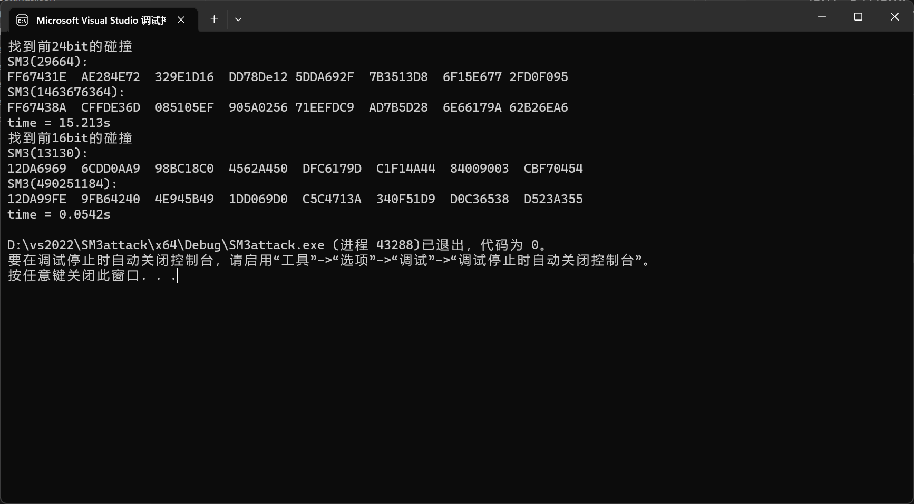

<div align="center">

</div>

<!-- ********************* Chapter1 ********************* -->

## 1 分工表格
<center>

| 姓名  |      学号      | 分工 |
|:---:|:------------:|----|
| 刘晨曦 | 202100460042 | SM3代码实现 |
| 卢梓宁 | 202100460043 | 生日攻击实现 |
| 陈辉华 | 202100460044 | 生日攻击实现|

</center>

<!-- ********************* Chapter2 ********************* -->

## 2 生日攻击

#### 2.1 攻击原理及分析 
 利用生日攻击找前n比特碰撞​ 随机生成字符串消息M，我们计算H=SM3(M)，如果我们只考虑前n比特，那么当我们遍历2^(n/2)中可能时，找到至少一对匹配的概率大于0.5. 根据这个原理我们可以实现 sm3 前nbit的碰撞

假设存在M‘，有SM3(M)=SM3(M')，那么我们在前2^n比特范围内找到M'的概率是1/2^n,但是我们找两个数m1和m2，满足m1-m2 = M’的概率则是（C2n，2）/2^n。
<!--**【代码实现】** -->


#### 2.2 代码实现
**【SM3实现】**
```
string compress(string str1, string str2) {//消息压缩函数
	string IV = str2;
	string A = IV.substr(0, 8), B = IV.substr(8, 8), C = IV.substr(16, 8), D = IV.substr(24, 8), E = IV.substr(32, 8), F = IV.substr(40, 8), G = IV.substr(48, 8), H = IV.substr(56, 8);
	string SS1 = "", SS2 = "", TT1 = "", TT2 = "";
	for (int j = 0; j < 64; j++) {
		SS1 = LeftShift(ModAdd(ModAdd(LeftShift(A, 12), E), LeftShift(T(j), (j % 32))), 7);
		SS2 = XOR(SS1, LeftShift(A, 12));
		TT1 = ModAdd(ModAdd(ModAdd(FF(A, B, C, j), D), SS2), str1.substr((j + 68) * 8, 8));
		TT2 = ModAdd(ModAdd(ModAdd(GG(E, F, G, j), H), SS1), str1.substr(j * 8, 8));
		D = C;
		C = LeftShift(B, 9);
		B = A;
		A = TT1;
		H = G;
		G = LeftShift(F, 19);
		F = E;
		E = P0(TT2);
	}
	string res = (A + B + C + D + E + F + G + H);
	//cout << endl;
	return res;
}

string iteration(string str) {//迭代压缩函数实现
	int num = str.size() / 128;
	string V = "7380166F4914B2B9172442D7DA8A0600A96F30BC163138AAE38DEE4DB0FB0E4E";
	string B = "", extensionB = "", compressB = "";
	for (int i = 0; i < num; i++) {
		//cout << "第 " << to_string(i + 1) << " 个消息分组：" << endl;
		//cout << endl;
		B = str.substr(i * 128, 128);
		extensionB = extension(B);
		compressB = compress(extensionB, V);
		V = XOR(V, compressB);
	}
	return V;
}


string SM3(string str,string output) {
	//cout << "原像为:" <<endl<< str<<endl;
	string paddingValue = padding(str);
	output = iteration(paddingValue);
	//cout << "杂凑值：" << endl;
	for (int i = 0; i < 8; i++) {
		cout << output.substr(i * 8, 8) << "  ";
	}cout << endl;
	return output;
}
```
**【SM3生日攻击】**
```
int Pollard_Rho(string image, string H, string c, string preiamge) //H = SM3(image) 
{
	unsigned int m1 = rand();
	unsigned int m2 = m1;
	while (true)
	{
		m1 = F(m1, c);
		m2 = F(F(m2, c), c);
		if (m2 == m1)
			return 1;
		unsigned int tmp = m2 - m1;
		string input = to_string(tmp).c_str();
		string output;
		SM3(input,output);
		string temp=to_string(tmp);
		if (!cmphash(H, output, Collisionlen)&&temp!=image)
		{	
			cout<<"找到前"<<24<<"bit的碰撞"<<endl;
			preiamge = temp;
			cout << "SM3(" << input << "):";
			cout << output << endl;
			return 0;
		}
	}
}
void  Attack(string image)
{
	string preimage;
	string image_input = image;
	string image_output;
	cout << "SM3(" << image_input << "):";
	SM3(image_input, image_output);
	cout << image_output << endl;

	unsigned int c = rand();
	string c_1=to_string(c);
	while (Pollard_Rho(image, image_output,c_1,preimage))
	{
		c = rand();
	}
}
```

<!-- ********************* Chapter3 ********************* -->

## 3 运行结果
对于我们给出的SM3 24bit的碰撞，时间开销大概为15s左右，
而16bit的碰撞只需要0.0542s。
>   
> <!-- 与md文件同一目录下的foldername文件夹，里的1.png图片 -->