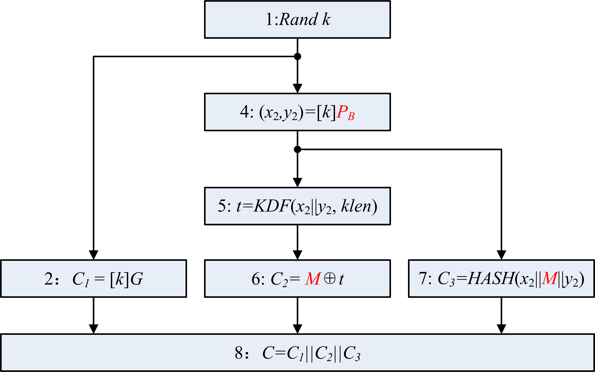
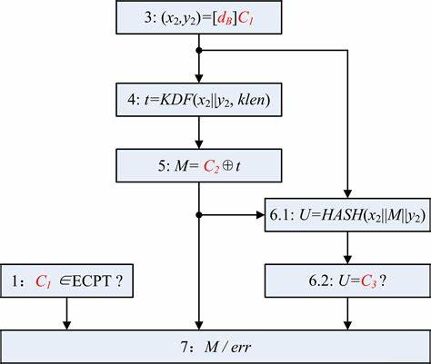
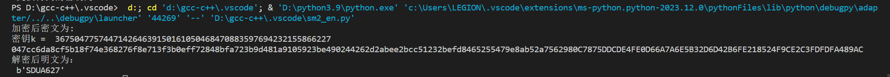
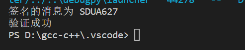
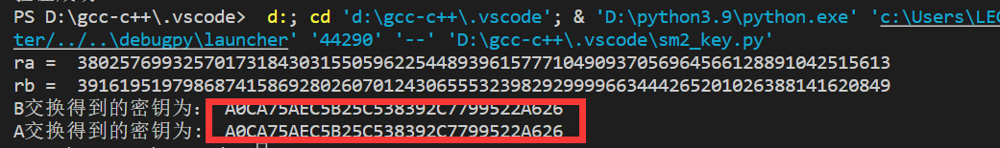

<div align="center">

</div>

<!-- ********************* Chapter1 ********************* -->

## 1 分工表格
<center>

| 姓名  |      学号      | 分工 |
|:---:|:------------:|----|
| 刘晨曦 | 202100460042 | SM2加密 |
| 卢梓宁 | 202100460043 | SM2密钥分发 |
| 陈辉华 | 202100460044 | SM2签名 |

</center>

<!-- ********************* Chapter2 ********************* -->

# 2 SM2 with RFC6979
RFC 6979: 确定性随机算法
确定性使用数字签名算法（DSA）和 椭圆曲线数字签名算法（ECDSA）

该标准定义了确定性的数字签名生成过程: 此类签名与标准数字签名算法（DSA）和椭圆曲线数字签名算法（ECDSA）数字签名兼容，并且可以使用未经修改的验证程序进行处理，这些验证程序无需了解其中描述的过程。确定性签名保留了与数字签名相关联的密码安全性功能，但是由于它们不需要访问高质量随机性源，因此可以在各种环境中更轻松地实现。

**签署相同的交易将生成相同的k值**

**签署不同的交易将生成不同的k值**

## 2.1 SM2_en 加密解密 
>   

加密过程： 设需要发送的消息为比特串 M ，klen 为 M 的比特长度。

为了对明文 M 进行加密，作为加密者的用户 A 应实现以下运算步骤：

1：用随机数发生器产生随机数k∈[1,n-1]；

2：计算椭圆曲线点 C1=[k]G=(x1,y1)，（[k]G 表示 k*G ）将C1的数据类型转换为比特串；

3：计算椭圆曲线点 S=[h]PB，若S是无穷远点，则报错并退出；

4：计算椭圆曲线点 [k]PB=(x2,y2)，将坐标 x2、y2 的数据类型转换为比特串；

5：计算t=KDF(x2 ∥ y2, klen)，若 t 为全0比特串，则返回 A1；

6：计算C2 = M ⊕ t；

7：计算C3 = Hash(x2 ∥ M ∥ y2)；

8：输出密文C = C1 ∥ C2 ∥ C3。

解密过程：

设klen为密文中C2的比特长度。

为了对密文C=C1 ∥ C2 ∥ C3 进行解密，作为解密者的用户 B 应实现以下运算步骤：

1：从C中取出比特串C1，将C1的数据类型转换为椭圆曲线上的点，验证C1是否满足椭圆曲线方程，若不满足则报错并退出；

2：计算椭圆曲线点 S=[h]C1，若S是无穷远点，则报错并退出；

3：计算[dB]C1=(x2,y2)，将坐标x2、y2的数据类型转换为比特串；

4：计算t=KDF(x2 ∥ y2, klen)，若t为全0比特串，则报错并退出；

5：从C中取出比特串C2，计算M′ = C2 ⊕ t；

6：计算u = Hash(x2 ∥ M′ ∥ y2)，从C中取出比特串C3，若u != C3，则报错并退出；

7：输出明文M′。


## 2.1 SM2_sig 签名验签 
密钥生成算法

Alice选择随机数dA做为私钥，其中0

Alice计算公钥PA=dA⋅G

输出密钥对 (sk=dA, pk=PA) 签名算法

设Alice发签名消息M给Bob，IDA是Alice的标识符，ENTLA是IDA的长度，dA是A的私钥，基点G= (xG, yG)，A的公钥PA=dA ⋅ G= (xA, yA).。

ZA=H (ENTLA ‖IDA ‖a‖b‖ xG ‖ yG ‖ xA ‖ yA)， H是SM3算法

①设置M*=ZA ‖M并计算 e = H(M*)

②产生随机数k∈[1, n-1]

③计算椭圆曲线点G1=k ⋅ G= (x1, y1)

④计算r=(e+x1) mod n，若r=0或r+k=n则返回②

⑤计算s=(1+ dA)−1·(k −r ·dA)mod n，若s=0则返回②

⑥以(r, s)作为对消息M的签名

>   

验证算法

接收到的消息为M′，签名为(r′, s′)和发送者Alice的公钥PA，Bob执行如下步骤验证合法性：

检验r′∈[1, n-1]是否成立，若不成立则验证不通过

检验s′∈[1, n-1]是否成立，若不成立则验证不通过

设置M*=ZA‖M′

计算e′= H(M* )

计算t= (r′ + s′) mod n，若t=0，则验证不通过

计算椭圆曲线点 (x1′，y1′)= s′ · G + t · PA

计算v=(e′+ x1′) mod n，检验v=r′是否成立，若成立则验证通过；否则验证不通过
<!--**【代码实现】** -->


# 3 代码实现
**【sm2_en】**
定义函数实现椭圆曲线上的加法和乘法
```
#椭圆曲线加法
def addition(x1,y1,x2,y2,a,p):
    if x1==x2 and y1==p-y2:
        return False
    if x1!=x2:
        lamda = ((y2-y1)*invert(x2-x1,p))%p
    else :
        lamda=(((3*x1*x1+a)%p)*invert(2*y1, p))%p
    
    x3=(lamda*lamda-x1-x2)%p
    y3=(lamda*(x1-x3)-y1)%p
    return x3,y3

#定义点乘
def mul_point(x,y,k,a,p):
    k = bin(k)[2:]
    qx, qy = x,y
    for i in range(1,len(k)):
        qx,qy=addition(qx,qy,qx,qy,a,p)
        if k[i] == '1':
            qx,qy=addition(qx,qy,x,y,a,p)
    return qx,qy

```
**【sm2_en】**
实现加解密函数
```
#sm2加密算法，接受str类型参数
def sm2_encrypt(m:str):
    plen=len(hex(p)[2:])
    m='0'*((4-(len(bin(int(m.encode().hex(),16))[2:])%4))%4)+bin(int(m.encode().hex(),16))[2:]
    klen=len(m)
    while True:
        k=randint(1,n)
        print("密钥k = ",k)
        while k==db:
            k=randint(1, n)
        x2,y2=mul_point(xb, yb, k, a, p)
        x2,y2='{:0256b}'.format(x2),'{:0256b}'.format(y2)
        t=kdf(x2+y2, klen)
        if int(t,2)!=0:
            break
    x1,y1=mul_point(gx, gy, k, a, p)
    x1,y1=(plen-len(hex(x1)[2:]))*'0'+hex(x1)[2:],(plen-len(hex(y1)[2:]))*'0'+hex(y1)[2:]
    c1='04'+x1+y1
    c2=((klen//4)-len(hex(int(m,2)^int(t,2))[2:]))*'0'+hex(int(m,2)^int(t,2))[2:]
    c3=SM3(hex(int(x2+m+y2,2))[2:])
    return c1,c2,c3

#sm2解密函数
def sm2_decrypt(c1,c2,c3):
    c1=c1[2:]
    x1,y1=int(c1[:len(c1)//2],16),int(c1[len(c1)//2:],16)
    if pow(y1,2,p)!=(pow(x1,3,p)+a*x1+b)%p:
        return False
    x2,y2=mul_point(x1, y1, db, a, p)
    x2,y2='{:0256b}'.format(x2),'{:0256b}'.format(y2)
    klen=len(c2)*4
    t=kdf(x2+y2, klen)
    if int(t,2)==0:
        return False
    m='0'*(klen-len(bin(int(c2,16)^int(t,2))[2:]))+bin(int(c2,16)^int(t,2))[2:]
    u=SM3(hex(int(x2+m+y2,2))[2:])
    if u!=c3:
        return False
    return hex(int(m,2))[2:]

```

**【sm2_sign】**
实现签名验签算法
```
def Sign(m,Za):
    m1=Za+m
    e=SM3(m1)
    #k=randint(1,n)
    k=0x6CB28D99385C175C94F94E934817663FC176D925DD72B727260DBAAE1FB2F96F
    x1,y1=mul_point(gx,gy,k)
    r=(int(e,16)+x1)%n
    s=(invert(1+da,n)*(k-r*da))%n
    return (hex(r)[2:].upper(),hex(s)[2:].upper())

def Verify(r,s,Za,m,Pa):
    if int(r,16) not in range(1,n-1):
        return False
    if int(s,16) not in range(1,n-1):
        return False
    m1=Za+m
    e=SM3(m1)
    t=(int(r,16)+int(s,16))%n
    if t==0:
        return False
    x1,y1=mul_point(Pa[0],Pa[1],t)
    x2,y2=mul_point(gx,gy,int(s,16))
    x1,y1=addition(x2,y2,x1,y1)
    R=(int(e,16)+x1)%n
    if(hex(R)[2:].upper()==r):
        return True
    return False

```
对“SDUA627”进行签名和验证
```
Pax,Pay=mul_point(gx,gy,da)
Pa=(Pax,Pay)
m="SDUA627"
print("签名的消息为",m)
m=hex(int(binascii.b2a_hex(m.encode()).decode(),16)).upper()[2:]
IDa="A6271@sdu.edu.cn"
ida=hex(int(binascii.b2a_hex(IDa.encode()).decode(),16)).upper()[2:]
ENTLa='{:04X}'.format(len(ida)*4)
m1=ENTLa+ida+'{:064X}'.format(a)+'{:064X}'.format(b)+'{:064X}'.format(gx)+'{:064X}'.format(gy)+'{:064X}'.format(Pa[0])+'{:064X}'.format(Pa[1])
Za=hex(int(SM3(m1),16))[2:].upper()

Sign=Sign(m,Za)
res=["验证失败","验证成功"]
print(res[Verify(*Sign,Za,m,Pa)])

```
**【sm2_key】**
实现密钥交换，这里只展示A
```
#A交换密钥
def Akey_Exchange(*Rb):
    Ra = mul_point(gx, gy, ra)
    ida = hex(int(binascii.b2a_hex(IDa.encode()).decode(), 16)).upper()[2:]
    ENTLa = '{:04X}'.format(len(ida) * 4)
    ma = ENTLa + ida + '{:064X}'.format(a) + '{:064X}'.format(b) + '{:064X}'.format(gx) + '{:064X}'.format(
        gy) + '{:064X}'.format(Pka[0]) + '{:064X}'.format(Pka[1])
    Za = SM3(ma)
    idb = hex(int(binascii.b2a_hex(IDb.encode()).decode(), 16)).upper()[2:]
    ENTLb = '{:04X}'.format(len(idb) * 4)
    mb = ENTLb + idb + '{:064X}'.format(a) + '{:064X}'.format(b) + '{:064X}'.format(gx) + '{:064X}'.format(
        gy) + '{:064X}'.format(Pkb[0]) + '{:064X}'.format(Pkb[1])
    Zb = SM3(mb)
    x1=((1<<w)+(Ra[0]&((1<<w)-1)))%(1<<128)
    ta=(da+x1*ra)%n
    x2=((1<<w)+(Rb[0]&((1<<w)-1)))%(1<<128)
    x,y=mul_point(Rb[0],Rb[1],x2)
    x,y=addition(Pkb[0],Pkb[1],x,y)
    U=mul_point(x,y,h*ta)
    t1, t2 = '{:064X}'.format(U[0]), '{:064X}'.format(U[1])
    m=t1+t2+Za+Zb
    m='{:01024b}'.format(int(m,16))
    Ka=KDF(m,klen)
    return hex(int(Ka, 2)).upper()[2:]
```


<!-- ********************* Chapter3 ********************* -->

## 4 运行结果
### 4.1 加密运行结果
加密消息"SDUA627"得到结果如下
>   

对消息"SDUA627"进行签名和验签
>   

密钥交换得到结果如下，可以看到A和B得到了一个一样的密钥
对消息"SDUA627"进行签名和验签
>  
> <!-- 与md文件同一目录下的foldername文件夹，里的1.png图片 --><div align="center">

</div>

<!-- ********************* Chapter1 ********************* -->

## 1 分工表格
<center>

| 姓名  |      学号      | 分工 |
|:---:|:------------:|----|
| 刘晨曦 | 202100460042 | SM2加密 |
| 卢梓宁 | 202100460043 | SM2密钥分发 |
| 陈辉华 | 202100460044 | SM2签名 |

</center>

<!-- ********************* Chapter2 ********************* -->

# 2 SM2 with RFC6979
RFC 6979: 确定性随机算法
确定性使用数字签名算法（DSA）和 椭圆曲线数字签名算法（ECDSA）

该标准定义了确定性的数字签名生成过程: 此类签名与标准数字签名算法（DSA）和椭圆曲线数字签名算法（ECDSA）数字签名兼容，并且可以使用未经修改的验证程序进行处理，这些验证程序无需了解其中描述的过程。确定性签名保留了与数字签名相关联的密码安全性功能，但是由于它们不需要访问高质量随机性源，因此可以在各种环境中更轻松地实现。

**签署相同的交易将生成相同的k值**

**签署不同的交易将生成不同的k值**

## 2.1 SM2_en 加密解密 
>   

加密过程： 设需要发送的消息为比特串 M ，klen 为 M 的比特长度。

为了对明文 M 进行加密，作为加密者的用户 A 应实现以下运算步骤：

1：用随机数发生器产生随机数k∈[1,n-1]；

2：计算椭圆曲线点 C1=[k]G=(x1,y1)，（[k]G 表示 k*G ）将C1的数据类型转换为比特串；

3：计算椭圆曲线点 S=[h]PB，若S是无穷远点，则报错并退出；

4：计算椭圆曲线点 [k]PB=(x2,y2)，将坐标 x2、y2 的数据类型转换为比特串；

5：计算t=KDF(x2 ∥ y2, klen)，若 t 为全0比特串，则返回 A1；

6：计算C2 = M ⊕ t；

7：计算C3 = Hash(x2 ∥ M ∥ y2)；

8：输出密文C = C1 ∥ C2 ∥ C3。

解密过程：

设klen为密文中C2的比特长度。

为了对密文C=C1 ∥ C2 ∥ C3 进行解密，作为解密者的用户 B 应实现以下运算步骤：

1：从C中取出比特串C1，将C1的数据类型转换为椭圆曲线上的点，验证C1是否满足椭圆曲线方程，若不满足则报错并退出；

2：计算椭圆曲线点 S=[h]C1，若S是无穷远点，则报错并退出；

3：计算[dB]C1=(x2,y2)，将坐标x2、y2的数据类型转换为比特串；

4：计算t=KDF(x2 ∥ y2, klen)，若t为全0比特串，则报错并退出；

5：从C中取出比特串C2，计算M′ = C2 ⊕ t；

6：计算u = Hash(x2 ∥ M′ ∥ y2)，从C中取出比特串C3，若u != C3，则报错并退出；

7：输出明文M′。


## 2.1 SM2_sig 签名验签 
密钥生成算法

Alice选择随机数dA做为私钥，其中0

Alice计算公钥PA=dA⋅G

输出密钥对 (sk=dA, pk=PA) 签名算法

设Alice发签名消息M给Bob，IDA是Alice的标识符，ENTLA是IDA的长度，dA是A的私钥，基点G= (xG, yG)，A的公钥PA=dA ⋅ G= (xA, yA).。

ZA=H (ENTLA ‖IDA ‖a‖b‖ xG ‖ yG ‖ xA ‖ yA)， H是SM3算法

①设置M*=ZA ‖M并计算 e = H(M*)

②产生随机数k∈[1, n-1]

③计算椭圆曲线点G1=k ⋅ G= (x1, y1)

④计算r=(e+x1) mod n，若r=0或r+k=n则返回②

⑤计算s=(1+ dA)−1·(k −r ·dA)mod n，若s=0则返回②

⑥以(r, s)作为对消息M的签名

>   

验证算法

接收到的消息为M′，签名为(r′, s′)和发送者Alice的公钥PA，Bob执行如下步骤验证合法性：

检验r′∈[1, n-1]是否成立，若不成立则验证不通过

检验s′∈[1, n-1]是否成立，若不成立则验证不通过

设置M*=ZA‖M′

计算e′= H(M* )

计算t= (r′ + s′) mod n，若t=0，则验证不通过

计算椭圆曲线点 (x1′，y1′)= s′ · G + t · PA

计算v=(e′+ x1′) mod n，检验v=r′是否成立，若成立则验证通过；否则验证不通过
<!--**【代码实现】** -->


# 3 代码实现
**【sm2_en】**
定义函数实现椭圆曲线上的加法和乘法
```
#椭圆曲线加法
def addition(x1,y1,x2,y2,a,p):
    if x1==x2 and y1==p-y2:
        return False
    if x1!=x2:
        lamda = ((y2-y1)*invert(x2-x1,p))%p
    else :
        lamda=(((3*x1*x1+a)%p)*invert(2*y1, p))%p
    
    x3=(lamda*lamda-x1-x2)%p
    y3=(lamda*(x1-x3)-y1)%p
    return x3,y3

#定义点乘
def mul_point(x,y,k,a,p):
    k = bin(k)[2:]
    qx, qy = x,y
    for i in range(1,len(k)):
        qx,qy=addition(qx,qy,qx,qy,a,p)
        if k[i] == '1':
            qx,qy=addition(qx,qy,x,y,a,p)
    return qx,qy

```
**【sm2_en】**
实现加解密函数
```
#sm2加密算法，接受str类型参数
def sm2_encrypt(m:str):
    plen=len(hex(p)[2:])
    m='0'*((4-(len(bin(int(m.encode().hex(),16))[2:])%4))%4)+bin(int(m.encode().hex(),16))[2:]
    klen=len(m)
    while True:
        k=randint(1,n)
        print("密钥k = ",k)
        while k==db:
            k=randint(1, n)
        x2,y2=mul_point(xb, yb, k, a, p)
        x2,y2='{:0256b}'.format(x2),'{:0256b}'.format(y2)
        t=kdf(x2+y2, klen)
        if int(t,2)!=0:
            break
    x1,y1=mul_point(gx, gy, k, a, p)
    x1,y1=(plen-len(hex(x1)[2:]))*'0'+hex(x1)[2:],(plen-len(hex(y1)[2:]))*'0'+hex(y1)[2:]
    c1='04'+x1+y1
    c2=((klen//4)-len(hex(int(m,2)^int(t,2))[2:]))*'0'+hex(int(m,2)^int(t,2))[2:]
    c3=SM3(hex(int(x2+m+y2,2))[2:])
    return c1,c2,c3

#sm2解密函数
def sm2_decrypt(c1,c2,c3):
    c1=c1[2:]
    x1,y1=int(c1[:len(c1)//2],16),int(c1[len(c1)//2:],16)
    if pow(y1,2,p)!=(pow(x1,3,p)+a*x1+b)%p:
        return False
    x2,y2=mul_point(x1, y1, db, a, p)
    x2,y2='{:0256b}'.format(x2),'{:0256b}'.format(y2)
    klen=len(c2)*4
    t=kdf(x2+y2, klen)
    if int(t,2)==0:
        return False
    m='0'*(klen-len(bin(int(c2,16)^int(t,2))[2:]))+bin(int(c2,16)^int(t,2))[2:]
    u=SM3(hex(int(x2+m+y2,2))[2:])
    if u!=c3:
        return False
    return hex(int(m,2))[2:]

```

**【sm2_sign】**
实现签名验签算法
```
def Sign(m,Za):
    m1=Za+m
    e=SM3(m1)
    #k=randint(1,n)
    k=0x6CB28D99385C175C94F94E934817663FC176D925DD72B727260DBAAE1FB2F96F
    x1,y1=mul_point(gx,gy,k)
    r=(int(e,16)+x1)%n
    s=(invert(1+da,n)*(k-r*da))%n
    return (hex(r)[2:].upper(),hex(s)[2:].upper())

def Verify(r,s,Za,m,Pa):
    if int(r,16) not in range(1,n-1):
        return False
    if int(s,16) not in range(1,n-1):
        return False
    m1=Za+m
    e=SM3(m1)
    t=(int(r,16)+int(s,16))%n
    if t==0:
        return False
    x1,y1=mul_point(Pa[0],Pa[1],t)
    x2,y2=mul_point(gx,gy,int(s,16))
    x1,y1=addition(x2,y2,x1,y1)
    R=(int(e,16)+x1)%n
    if(hex(R)[2:].upper()==r):
        return True
    return False

```
对“SDUA627”进行签名和验证
```
Pax,Pay=mul_point(gx,gy,da)
Pa=(Pax,Pay)
m="SDUA627"
print("签名的消息为",m)
m=hex(int(binascii.b2a_hex(m.encode()).decode(),16)).upper()[2:]
IDa="A6271@sdu.edu.cn"
ida=hex(int(binascii.b2a_hex(IDa.encode()).decode(),16)).upper()[2:]
ENTLa='{:04X}'.format(len(ida)*4)
m1=ENTLa+ida+'{:064X}'.format(a)+'{:064X}'.format(b)+'{:064X}'.format(gx)+'{:064X}'.format(gy)+'{:064X}'.format(Pa[0])+'{:064X}'.format(Pa[1])
Za=hex(int(SM3(m1),16))[2:].upper()

Sign=Sign(m,Za)
res=["验证失败","验证成功"]
print(res[Verify(*Sign,Za,m,Pa)])

```
**【sm2_key】**
实现密钥交换，这里只展示A
```
#A交换密钥
def Akey_Exchange(*Rb):
    Ra = mul_point(gx, gy, ra)
    ida = hex(int(binascii.b2a_hex(IDa.encode()).decode(), 16)).upper()[2:]
    ENTLa = '{:04X}'.format(len(ida) * 4)
    ma = ENTLa + ida + '{:064X}'.format(a) + '{:064X}'.format(b) + '{:064X}'.format(gx) + '{:064X}'.format(
        gy) + '{:064X}'.format(Pka[0]) + '{:064X}'.format(Pka[1])
    Za = SM3(ma)
    idb = hex(int(binascii.b2a_hex(IDb.encode()).decode(), 16)).upper()[2:]
    ENTLb = '{:04X}'.format(len(idb) * 4)
    mb = ENTLb + idb + '{:064X}'.format(a) + '{:064X}'.format(b) + '{:064X}'.format(gx) + '{:064X}'.format(
        gy) + '{:064X}'.format(Pkb[0]) + '{:064X}'.format(Pkb[1])
    Zb = SM3(mb)
    x1=((1<<w)+(Ra[0]&((1<<w)-1)))%(1<<128)
    ta=(da+x1*ra)%n
    x2=((1<<w)+(Rb[0]&((1<<w)-1)))%(1<<128)
    x,y=mul_point(Rb[0],Rb[1],x2)
    x,y=addition(Pkb[0],Pkb[1],x,y)
    U=mul_point(x,y,h*ta)
    t1, t2 = '{:064X}'.format(U[0]), '{:064X}'.format(U[1])
    m=t1+t2+Za+Zb
    m='{:01024b}'.format(int(m,16))
    Ka=KDF(m,klen)
    return hex(int(Ka, 2)).upper()[2:]
```


<!-- ********************* Chapter3 ********************* -->

## 4 运行结果
### 4.1 加密运行结果
加密消息"SDUA627"得到结果如下
>   

对消息"SDUA627"进行签名和验签
>   

密钥交换得到结果如下，可以看到A和B得到了一个一样的密钥
对消息"SDUA627"进行签名和验签
>  
> <!-- 与md文件同一目录下的foldername文件夹，里的1.png图片 -->