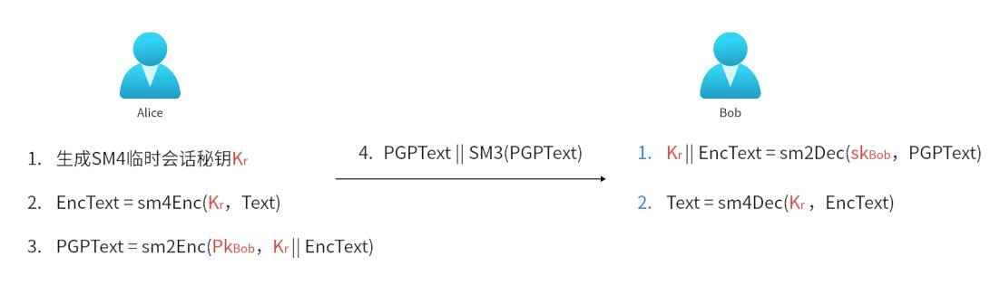
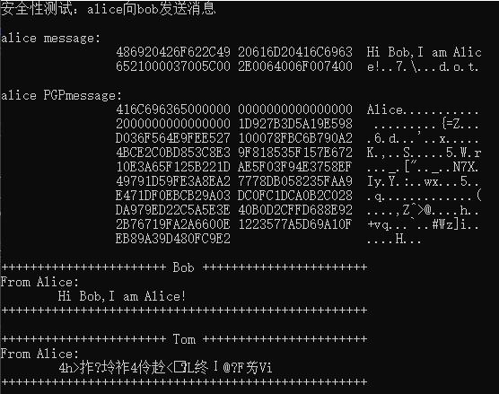
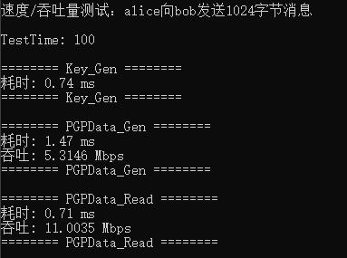

<div align="center">

</div>

# Project14 — Implement a PGP scheme with SM2

<!-- ********************* Chapter1 ********************* -->

## 1 分工表格
<center>

| 姓名  |      学号      | 分工 |
|:---:|:------------:|----|
| 刘晨曦 | 202100460042 | PGP代码编写与测试 |
| 卢梓宁 | 202100460043 | SM系列代码编写 |
| 陈辉华 | 202100460044 | PRG算法编写与代码优化 |

</center>


<!-- ********************* Chapter2 ********************* -->

## 2 PGP框架构造

本项目的PGP协议基于国密算法原语SM2/SM3/SM4，随机数生成器PRG基于c++密码学库bcrypt.lib。具体框架如下：
> 

具体算法应用涉及UserID、时间戳等信息，需要对PGP报文进行设计:
```
	PGPData数据报格式：
		  8    bytes: uint8_t[]  UserID		
		  8    bytes: size_t	 EncMessage_Len		加密后消息长度
		  ?    bytes: uint8_t[]  Message
		16+96  bytes: uint8_t[]  EncSessionKey
```

相关代码如下：


```
/* Alice步骤1~3 */
void PGP::SendData() {
	if (this->RecverPubKey.pubX == NULL) {
		cout << "未设置接收方公钥!" << endl;
		return;
	}
	else if (this->messageLen == 0) {
		cout << "没有信息需要发送!" << endl;
		return;
	}
	
	this->PGPmessage = (uint8_t*)malloc(16 + 2048);
	uint8_t* Point = this->PGPmessage;

	//添加身份信息UserID
	memcpy(Point, this->UserID, USERID_BYTE);
	Point += USERID_BYTE;

	//随机生成SM4会话秘钥
	random_bytes_default(this->SessionKey, SM4_blockS);

	//使用会话秘钥对message加密
	Paddata(&this->message, &this->messageLen, SM4_blockS);
	memcpy(Point, &this->messageLen, sizeof(size_t));
	Point += sizeof(size_t);
	this->PGPmessageLen += sizeof(size_t);

	sm4Enc(this->message, this->messageLen, Point, this->SessionKey);
	Point += this->messageLen;
	this->PGPmessageLen += this->messageLen;

	//使用Reciver的公钥加密会话秘钥
	sm2_encrypt(this->SessionKey, SM4_blockS, &this->RecverPubKey, Point);
	this->PGPmessageLen += 96 + 16;

}
```


```
/* Bob步骤1~2 */
void PGP::ReadData(uint8_t* PGPmessage,size_t PGPmessageLen) {
	if (this->sm2Key.priKey == NULL) {
		cout << "尚未生成sm2私钥！" << endl;
		return;
	}
	
	uint8_t* Point = PGPmessage;
	
	//提取发件人信息
	memcpy(this->RecvUserID, Point, USERID_BYTE);
	Point += USERID_BYTE;

	//提取EncMessage_Len
	memcpy(&this->messageLen, Point, sizeof(size_t));
	Point += sizeof(size_t);

	//提取EncMessage
	uint8_t* cipherText = (uint8_t*)malloc(this->messageLen);
	memcpy(cipherText, Point, this->messageLen);
	Point += this->messageLen;

	//提取EncSessionKey
	uint8_t EncSessionKey[16 + 96];
	memcpy(EncSessionKey, Point, 16 + 96);
	sm2_decrypt(EncSessionKey, 16 + 96, this->sm2Key.priKey, this->sm2Key.priKeyLen, this->SessionKey);

	//利用SessionKey解密EncMessage获取Message
	this->message = (uint8_t*)malloc(this->messageLen);
	sm4Dec(cipherText, this->messageLen, this->message, this->SessionKey);
}
```

## 3 项目结果

### 3.1 测试环境
PGP_on_SM2相关测试与优化都在visual studio 2022编译器环境下运行。具体硬件环境如下：

<center>

|  |        |
|:---:|:-----:|
| CPU | 11th Gen Intel CoreTM i5-11400H |
| 基频 | 2.70GHz |
| 内存 | 16GB(3200 MHz) |
| 逻辑处理器 | 12个 |

</center>

### 3.2 应用测试
模拟测试Alice与Bob之间的PGP通信：

> 

测试在1024Bytes数据量下PGP协议速度与吞吐量：

> 


## 4 文件索引

+ **代码文件**  project14/PGP_on_SM下，PGP项目文件(Visual studio 2022)

+ **执行文件**	project14/PGPTest.exe, 应用测试与速度测试可执行文件