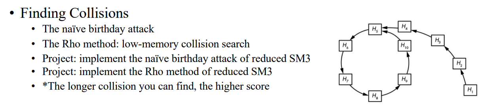
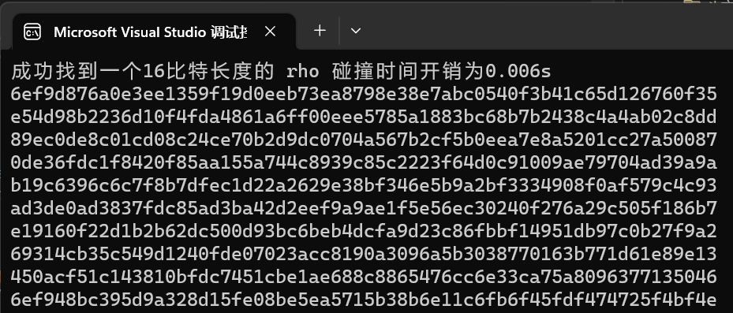
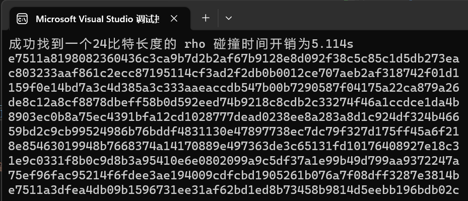

<div align="center">

</div>

<!-- ********************* Chapter1 ********************* -->

## 1 分工表格
<center>

| 姓名  |      学号      | 分工 |
|:---:|:------------:|----|
| 刘晨曦 | 202100460042 | Rho碰撞实现 |
| 卢梓宁 | 202100460043 | Rho碰撞实现 |
| 陈辉华 | 202100460044 | Rho碰撞实现 |

</center>

<!-- ********************* Chapter2 ********************* -->

## 2 Rho碰撞

#### 2.1 碰撞原理及分析 
碰撞的原理十分简单，我们只需要从一个初始值出发，不断计算SM3值，就可能成环（前n bit），有点类似生日攻击。

>   
<!--**【代码实现】** -->


#### 2.2 代码实现
**【Rho碰撞】**
定义消息”2021004600,通过不断计算SM3杂凑值，来形成一个闭环，即找到了attck_len长度的碰撞，最后输出环中所有的杂凑值。
```
int main()
{
	unsigned char msg[] = "2021004600";
	size_t attack_len = 4;
	size_t Rho_len = 10;
	tmp* Rho = new tmp[Rho_len];
	My_sm3(msg, 26, Rho[0].dgst);
	int i = 0;
	//测试时间
	clock_t t1 = clock();
	//寻找attack_len 长度的碰撞
	while (memcmp(Rho[i].dgst, Rho[(i + 1) % Rho_len].dgst, attack_len) != 0) {
		My_sm3(Rho[i].dgst, SM3_DIGEST_LENGTH , Rho[(i + 1) % Rho_len].dgst);
		i = (i + 1) % Rho_len;
	}
	clock_t t2 = clock();
	cout << "成功找到一个" << attack_len *8 << "比特长度的 rho 碰撞";
	cout << "时间开销为" << double(t2 - t1) / CLOCKS_PER_SEC <<"s" << endl;
	i = (i + 1) % Rho_len;
	for (int j = 0; j < Rho_len; j++) {
		for (int k = 0; k < SM3_DIGEST_LENGTH ; k++)
			printf("%02x", Rho[i].dgst[k]);
		printf("\n");
		i = (i + 1) % Rho_len;
	}
	delete[]Rho;
	return 0;
}
```


<!-- ********************* Chapter3 ********************* -->

## 3 运行结果
得到的碰撞如下图所示：
对于我们给出16bit的碰撞只需要0.006s。
>   

而24bit需要5.114s
>   

> <!-- 与md文件同一目录下的foldername文件夹，里的1.png图片 -->