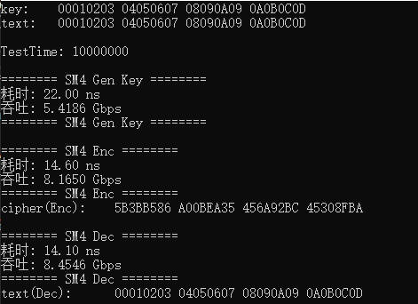

<div align="center">

</div>

<!-- ********************* Chapter1 ********************* -->

## 1 分工表格
<center>

| 姓名  |      学号      | 分工 |
|:---:|:------------:|----|
| 刘晨曦 | 202100460042 | 吞吐优化 |
| 卢梓宁 | 202100460043 | 代码编写 |
| 陈辉华 | 202100460044 | 代码优化 |

</center>

<!-- ********************* Chapter2 ********************* -->

## 2 优化原理

**【查表实现】**  

### 2.1 查表实现

1. try
> - try
SM4加/解密轮函数中的T变换由非线性变换τ和线性变换L构成。可将非线性变换τ的操作定义如下。

$$y_i = Sbox(x_i) , 0 \leq i < 4   (1)$$

可由非线性变换τ与线性变换L合并表示为：

$$Q = T(X) =L(Sbox(x_0) << (n-1)m) \oplus L(Sbox(x_1) << (n-2)m) \oplus \cdots \oplus L(Sbox(x_{n-1}))(3)$$

这里可将非线性变换T的操作制成4个8-bit输入32-bit输出的表，具体T盒生成代码见同级文件TBOXGen.py

### 2.2 循环展开&&模加优化

SM4将明文分为4个字节块操作，故而加密过程涉及4个字节块的循环读取，常规方法为对数组通过模加运算与循环结合读取数据，这将带来巨大的计算消耗
，由于涉及的模加群阶为4，通过宏定义对4次加密操作进行提前定义，循环展开同时避免了大量的模加运算，下面是核心代码

#### 2.2.1 代码

```
#define SM4_RNDS(k0, k1, k2, k3, F)          \
    do {                                     \
        Text0 ^= F(Text1 ^ Text2 ^ Text3 ^ ks->rk[k0]); \
        Text1 ^= F(Text0 ^ Text2 ^ Text3 ^ ks->rk[k1]); \
        Text2 ^= F(Text0 ^ Text1 ^ Text3 ^ ks->rk[k2]); \
        Text3 ^= F(Text0 ^ Text1 ^ Text2 ^ ks->rk[k3]); \
    } while(0)
```

<!-- ********************* Chapter3 ********************* -->

## 3 运行结果
对各个阶段进行运行时间(ns)和吞吐量测试(Gbps),单次SM4运行时间达到14ns，吞吐量约8Gbps。
>   
> <!-- 与md文件同一目录下的foldername文件夹，里的1.png图片 -->